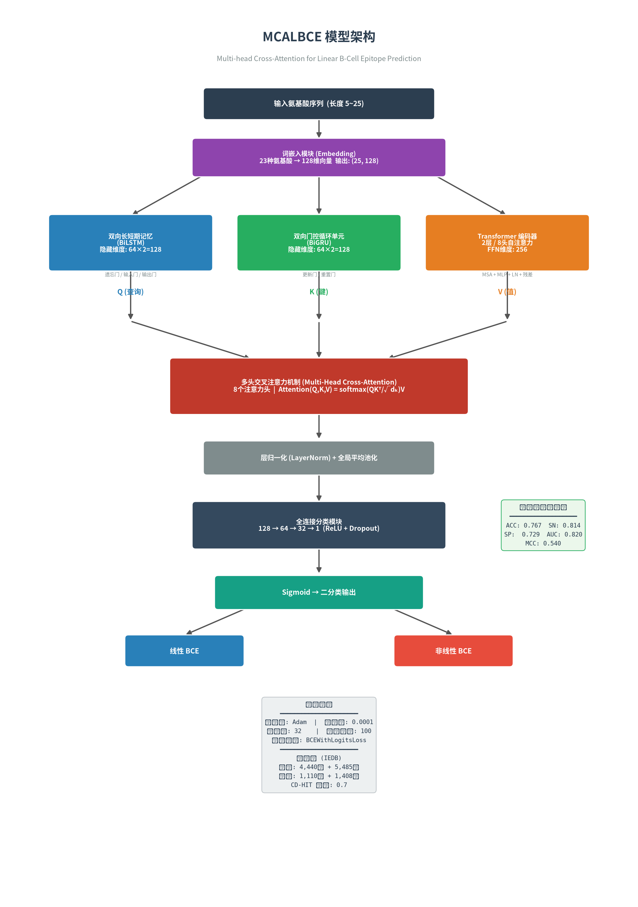

# MCALBCE：基于多头交叉注意力机制的线性B细胞表位预测

论文复现：

> 任静怡, 张胜利. 基于多头交叉注意力机制的线性B细胞表位预测[J]. 生物信息学, 2026, 24(2): 127-137.
>
> REN Jingyi, ZHANG Shengli. Predicting linear B-cell epitopes with multi-head cross-attention networks.

---

## 模型架构



### 架构说明

MCALBCE 模型包含六个核心模块，整体流程如下：

**1. 词嵌入模块 (Embedding)**

将氨基酸序列转换为可学习的稠密向量表示。20种常见氨基酸 + 3种非常见氨基酸（X, U, O）分别映射为整数编码 1-23，再通过 `nn.Embedding` 层映射到 128 维向量空间。每条序列（长度 5~25，统一填充到 25）输出形状为 `(25, 128)` 的特征矩阵。

$$X_{emb} = Embedding(X) \in \mathbb{R}^{25 \times 128}$$

**2. 双向长短期记忆模块 (BiLSTM) → 查询向量 Q**

通过正向（氨基端→羧基端）和反向（羧基端→氨基端）两个 LSTM 层，捕获蛋白质序列的局部和全局双向上下文特征。采用遗忘门、输入门和输出门的门控机制动态调节氨基酸残基间的长程依赖：

- 遗忘门：$f_t = \sigma(W_f \cdot [h_{t-1}, x_t] + b_f)$
- 输入门：$i_t = \sigma(W_i \cdot [h_{t-1}, x_t] + b_i)$
- 候选记忆：$\tilde{C}_t = \tanh(W_C \cdot [h_{t-1}, x_t] + b_C)$
- 细胞状态更新：$C_t = f_t \odot C_{t-1} + i_t \odot \tilde{C}_t$
- 输出门：$o_t = \sigma(W_O \cdot [h_{t-1}, x_t] + b_O)$
- 隐藏状态：$h_t = o_t \odot \tanh(C_t)$

隐藏维度 64，双向拼接后输出 128 维，作为交叉注意力的**查询向量 Q**。

**3. 双向门控循环单元模块 (BiGRU) → 键向量 K**

使用更新门和重置门两个门控机制，将单元状态和输出合并为一个状态，捕获序列的历史与未来上下文信息：

- 更新门：$z_t = \sigma(W_z \cdot [h_{t-1}, x_t])$
- 重置门：$r_t = \sigma(W_r \cdot [h_{t-1}, x_t])$
- 候选隐藏状态：$\tilde{h}_t = \tanh(W \cdot [r_t \circ h_{t-1}, x_t])$
- 隐藏状态更新：$h_t = (1 - z_t) \circ h_{t-1} + z_t \circ \tilde{h}_t$

隐藏维度 64，双向拼接后输出 128 维，作为交叉注意力的**键向量 K**。

**4. Transformer 编码模块 → 值向量 V**

仅使用 Transformer 的编码器部分（2 层编码器，每层包含 8 头多头自注意力和前馈网络）。在每个模块前使用层归一化（LN）和残差连接：

$$X_{i,output} = MSA(LN(X_{emb})) + X_{emb}$$
$$X_{i,output} = MLP(LN(X_{i,output})) + X_{i,output}$$

输入前添加位置编码以保留序列位置信息，输出 128 维上下文嵌入表示，作为交叉注意力的**值向量 V**。

**5. 多头交叉注意力机制模块 (Multi-Head Cross-Attention)**

核心融合模块，将三个分支的输出通过 8 个注意力头进行多视角特征交互：

$$Head_i = Attention(QW_i^Q, KW_i^K, VW_i^V)$$

$$Attention(Q, K, V) = softmax\left(\frac{QK^T}{\sqrt{d_k}}\right)V$$

$$MultiHead(Q, K, V) = Concat(Head_1, \ldots, Head_8) W^O$$

其中 $d_k = 128 / 8 = 16$ 为每个头的维度。通过将 BiLSTM（局部依赖）、BiGRU（双向时序）、Transformer（全局上下文）的特征融合，使模型捕获多层次的序列信息。

**6. 分类模块**

全局平均池化将序列维度压缩为固定长度向量，再通过全连接层进行二分类：

```
128 → FC+ReLU+Dropout → 64 → FC+ReLU+Dropout → 32 → FC → 1 → Sigmoid
```

---

## 项目结构

```
MCALBCE/
├── model.py                      # 模型架构定义（MCALBCE + 多头交叉注意力）
├── dataset.py                    # 数据集处理（氨基酸编码、Dataset类、合成数据生成）
├── train.py                      # 训练脚本（支持自定义超参数）
├── predict.py                    # 单序列/批量预测推理
├── visualize.py                  # 可视化分析（ROC、t-SNE、ISM热图、SHAP分析）
├── prepare_data.py               # IEDB 数据下载与预处理脚本
├── generate_architecture_diagram.py  # 生成模型架构流程图
├── requirements.txt              # Python 依赖
├── figures/                      # 生成的图表
│   └── architecture.png          # 模型架构图
├── data/                         # 数据集目录（需自行准备或生成）
└── checkpoints/                  # 模型检查点
```

---

## 环境配置

```bash
pip install -r requirements.txt
```

依赖：PyTorch >= 1.12, NumPy, Pandas, scikit-learn, matplotlib, seaborn, tqdm

---

## 使用方法

### 1. 准备数据

**方式一：使用内置合成数据（快速验证）**

不需要额外数据，直接训练即可。合成数据模拟了论文中氨基酸分布特征（D/N 在表位中富集，L/M 在非表位中富集）。

**方式二：从 IEDB 下载真实数据**

```bash
# 自动下载（需网络通畅，IEDB 可能有 IP 限制）
python prepare_data.py --download

# 或手动下载后处理
# 1. 访问 https://www.iedb.org/database_export_v3.php
# 2. 选择 B Cell Assays → Epitope Type: Linear peptide → 导出 CSV
# 3. 运行：
python prepare_data.py --input data/bcell_full_v3.csv
```

数据预处理包括：序列清洗（保留标准氨基酸，长度 5-25）、CD-HIT 去同源（阈值 0.7）、训练/测试集划分（8:2）。

**方式三：使用自定义 CSV 文件**

CSV 文件需包含序列列（如 `sequence`）和标签列（如 `label`，1=线性BCE，0=非线性BCE）。

### 2. 训练模型

```bash
# 使用合成数据训练
python train.py

# 使用真实数据训练
python train.py --train_file data/train.csv --test_file data/test.csv

# 自定义超参数
python train.py --epochs 100 --batch_size 32 --lr 0.0001 --cross_attn_heads 8
```

训练过程会每 10 个 epoch 输出一次训练集和测试集的指标（ACC, SN, SP, AUC, MCC），并保存最佳模型到 `checkpoints/best_model.pt`。

### 3. 预测

```bash
python predict.py --model_path checkpoints/best_model.pt --sequences ADGPKRSQD LLLMAVGHI DNKPWEQAK
```

输出每条序列的预测概率和分类结果（线性 BCE / 非线性 BCE）。

### 4. 可视化分析

```bash
python visualize.py --model_path checkpoints/best_model.pt
```

生成以下图表到 `figures/` 目录：

| 图表 | 说明 |
|------|------|
| `roc_curve.png` | ROC 曲线与 AUC 值 |
| `tsne.png` | t-SNE 降维可视化（特征提取前 vs 后） |
| `ism_heatmap.png` | 计算机模拟突变 (ISM) 热图 |
| `aa_frequency.png` | 正负样本氨基酸频率分布 |
| `shap_values.png` | 基于留一法的特征贡献分析（类 SHAP） |

### 5. 生成架构图

```bash
python generate_architecture_diagram.py
# 输出: figures/architecture.png
```

---

## 超参数设置（遵循论文）

| 参数 | 值 | 说明 |
|------|----|------|
| 词嵌入维度 | 128 | 每个氨基酸的向量维度 |
| BiLSTM 隐藏维度 | 64 (×2=128) | 双向拼接后 128 维 |
| BiGRU 隐藏维度 | 64 (×2=128) | 双向拼接后 128 维 |
| Transformer 编码层数 | 2 | 编码器堆叠层数 |
| Transformer 自注意力头数 | 8 | 编码器内的 MSA 头数 |
| Transformer FFN 维度 | 256 | 前馈网络隐藏层维度 |
| 交叉注意力头数 | 8 | 多头交叉注意力的头数 |
| 最大序列长度 | 25 | 不足补零，超出截断 |
| 批大小 (batch size) | 32 | — |
| 训练轮数 (epochs) | 100 | — |
| 学习率 | 0.0001 | — |
| 优化器 | Adam | 自适应矩估计 |
| 损失函数 | BCEWithLogitsLoss | 二分类交叉熵 |
| Dropout | 0.1 | 防止过拟合 |

---

## 数据集说明

| 数据集 | 线性 BCE (正样本) | 非线性 BCE (负样本) |
|--------|:-----------------:|:-------------------:|
| 训练集 | 4,440 | 5,485 |
| 独立测试集 | 1,110 | 1,408 |

- **数据来源**: IEDB (Immune Epitope Database) 免疫表位数据库
- **序列长度**: 5 ~ 25 个氨基酸
- **去冗余**: CD-HIT 阈值 0.7

---

## 论文报告的性能指标

| 指标 | 训练集 | 独立测试集 |
|------|:------:|:---------:|
| ACC (准确率) | 0.792 | 0.767 |
| SN (敏感性) | 0.835 | 0.814 |
| SP (特异性) | — | 0.729 |
| AUC (曲线下面积) | 0.858 | 0.820 |
| MCC (马修相关系数) | 0.589 | 0.540 |

---

## 评价指标公式

$$ACC = \frac{TP + TN}{TP + TN + FP + FN}$$

$$SN = \frac{TP}{TP + FN} \quad (敏感性/召回率)$$

$$SP = \frac{TN}{TN + FP} \quad (特异性)$$

$$MCC = \frac{TP \times TN - FP \times FN}{\sqrt{(TP+FP)(TP+FN)(TN+FN)(TN+FP)}}$$

其中 TP = 正确识别的线性 BCE，TN = 正确识别的非线性 BCE，FP = 误判为线性 BCE，FN = 漏判的线性 BCE。

---

## 引用

```
任静怡, 张胜利. 基于多头交叉注意力机制的线性B细胞表位预测[J]. 生物信息学, 2026, 24(2): 127-137.
DOI: 10.12113/20250401​4
```
